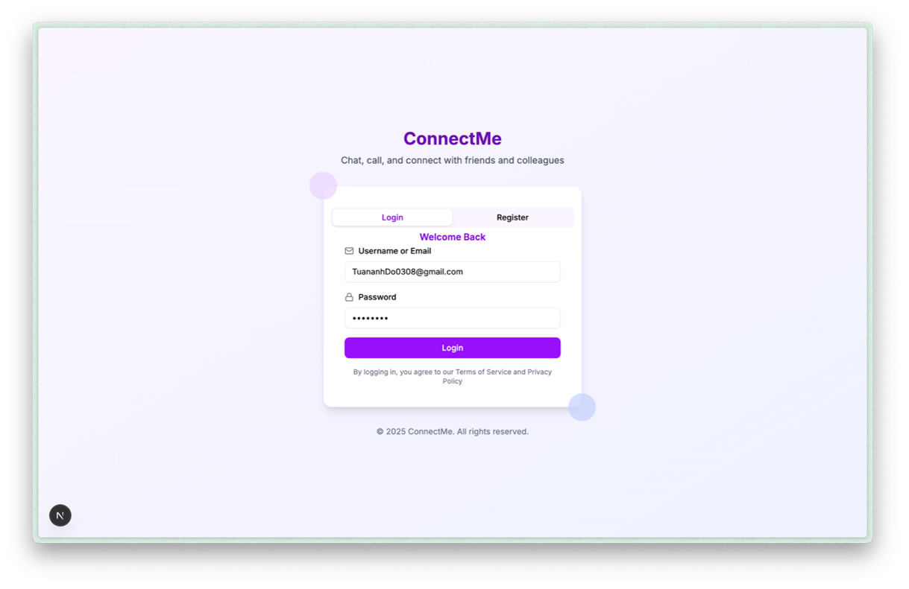
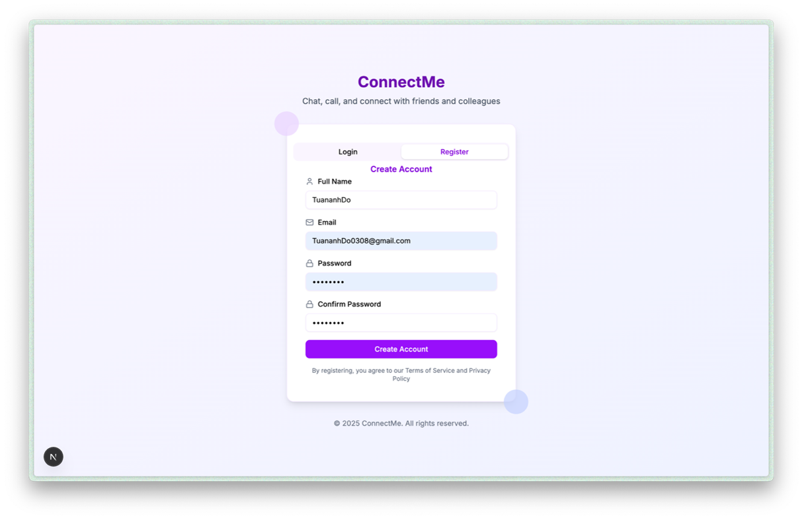
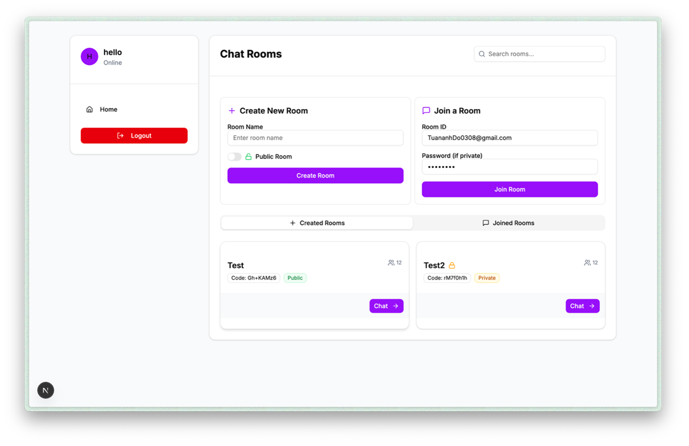
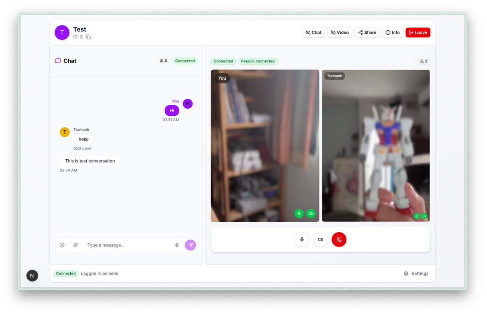

## Description

The **Real-Time Meeting Platform** is a web-based application designed for seamless online communication through text chat and video calls. Built with modern web technologies, it leverages **WebSocket** for low-latency messaging and **WebRTC** for peer-to-peer video and audio streaming. The platform enables users to join chat rooms, send instant messages, and participate in video calls with real-time interaction, making it ideal for virtual meetings, collaborative discussions, and social gatherings.

This project was developed by a team of five students as part of a university assignment for the **Web Technology** course at Ho Chi Minh City University of Education. The frontend was primarily handled by Đỗ Trần Tuấn Anh, focusing on a responsive and animated user interface.

Key features include:
- **Real-Time Chat**: Instant messaging in chat rooms using WebSocket for low-latency communication.
- **Video Calls**: Peer-to-peer video and audio calls with WebRTC, including camera and microphone controls.
- **Secure Authentication**: User login and registration with Spring Security.
- **Responsive Design**: Optimized for desktops and mobile devices with Tailwind CSS and Framer Motion animations.
- **Scalable Architecture**: Supports multiple concurrent users with a robust Spring Boot backend.

---

## Related Repositories

- **Frontend**: [Meeting Platform Frontend Repository](https://github.com/TuananhDo0308/videoCall.git)
- **Backend**: [Meeting Platform Backend Repository](https://github.com/TuananhDo0308/videoCallBE.git)

---

## Preview

### 1. Website UI
  
*Login interface for secure user authentication*

### 2. Key Features
#### Registration Page
  
*User registration interface*

#### Chat Rooms
  
*Interface displaying available chat rooms*

#### Chat and Video Call Interface
  
*Real-time chat and video call interface*

---

### Features

- **User Authentication**: Secure login and registration with Spring Security, supporting username/password-based access.
- **Real-Time Messaging**: Join chat rooms and exchange messages instantly using WebSocket (SockJS/STOMP).
- **Video Calls**: Initiate and join peer-to-peer video calls within chat rooms using WebRTC, with controls for enabling/disabling camera and microphone.
- **Room Management**: Create and join multiple chat rooms for group discussions.
- **Typing Indicators**: Real-time notifications when users are typing in a chat room.
- **Participant Updates**: Dynamic updates of room participants (join/leave notifications).
- **Responsive Animations**: Smooth UI transitions and effects powered by Framer Motion.
- **Scalable Backend**: Java Spring Boot with WebSocket support for handling concurrent connections.

---

## Table of Contents

- [Getting Started](#getting-started)
- [Prerequisites](#prerequisites)
- [Installation](#installation)
- [Configuration](#configuration)
- [Running the Project](#running-the-project)
- [Usage](#usage)
- [Tech Stack](#tech-stack)
- [Team Contributions](#team-contributions)
- [License](#license)

---

## Getting Started

Follow these steps to set up and run the **Real-Time Meeting Platform** locally.

---

## Prerequisites

Ensure you have the following installed:

- **Node.js**: Version 18.x or higher.
- **Java**: JDK 17 or higher.
- **Gradle**: For building the Spring Boot backend.
- **MySQL**: Version 8.x or higher for the database.
- **Git**: For cloning the repositories.
- **STUN/TURN Servers**: For WebRTC video call support (e.g., Google STUN servers).

---

## Installation

1. **Clone the Repositories**:

   ```bash
   git clone https://github.com/TuananhDo0308/meeting-frontend.git
   git clone https://github.com/TuananhDo0308/meeting-backend.git
   cd meeting-frontend
   ```

2. **Install Frontend Dependencies**:

   ```bash
   npm install
   ```

3. **Install Backend Dependencies**:

   Navigate to the backend repository:

   ```bash
   cd ../meeting-backend
   ./gradlew build
   ```

4. **Set Up the Database**:

   - Create a MySQL database (e.g., `meeting_db`).
   - Update the backend configuration file (`application.properties`) with your database credentials:

     ```properties
     spring.datasource.url=jdbc:mysql://localhost:3306/meeting_db
     spring.datasource.username=your_username
     spring.datasource.password=your_password
     ```

5. **Configure WebSocket and WebRTC**:

   - Ensure the backend WebSocket endpoint (`/ws`) is accessible.
   - Use Google STUN servers for WebRTC or set up custom STUN/TURN servers in the frontend configuration:

     ```javascript
     const iceServers = [
       { urls: "stun:stun.l.google.com:19302" },
       // Add TURN servers if needed
     ];
     ```

---

## Configuration

1. **Frontend Configuration**:

   - Update the API base URL in the frontend to point to your backend:

     ```javascript
     // src/config/api.js
     export const apiLinks = "http://localhost:8080";
     ```

2. **Backend Configuration**:

   - Configure WebSocket in `application.properties`:

     ```properties
     spring.websocket.stomp.endpoint=/ws
     spring.websocket.stomp.allowed-origins=*
     ```

   - Set up Spring Security for WebSocket authentication (e.g., username/password or JWT).

3. **Environment Variables**:

   - Ensure all required environment variables are set in `.env.local` (frontend) and `application.properties` (backend).

---

## Running the Project

### Local Development

1. **Start the Backend**:

   ```bash
   cd meeting-backend
   ./gradlew bootRun
   ```

   The backend will run on `http://localhost:8080`.

2. **Start the Frontend**:

   ```bash
   cd meeting-frontend
   npm run dev
   ```

   The frontend will run on `http://localhost:3000`.

3. **Access the Application**:

   - Open `http://localhost:3000` in your browser.
   - Register or log in to access the platform.
   - Join chat rooms, send messages, or start video calls.

### Production

1. **Build the Frontend**:

   ```bash
   npm run build
   npm run start
   ```

2. **Deploy the Backend**:

   - Package the Spring Boot application:

     ```bash
     ./gradlew build
     java -jar build/libs/meeting-backend.jar
     ```

   - Deploy to a cloud platform (e.g., AWS, Heroku) and configure a production database.

3. **Set Up a Domain**:

   - Purchase a domain and configure DNS to point to your server.
   - Use a reverse proxy (e.g., Nginx) to handle WebSocket connections.

---

## Usage

Once the platform is running, users can:

- **Register/Login**: Create an account or log in with username/password credentials.
- **Join Chat Rooms**: Select or create chat rooms for group discussions.
- **Send Messages**: Communicate in real-time with other users in the same room.
- **Start Video Calls**: Initiate video calls within a chat room, with options to toggle camera and microphone.
- **Receive Notifications**: Get real-time updates for typing indicators and participant changes.
- **Manage Sessions**: Log out securely to end the session.

Admins can:
- Monitor active chat rooms and user activities.
- Manage user accounts and ensure platform compliance.

---

## Tech Stack

- **Frontend**:
  - **Next.js**: React framework for dynamic UI and Server-Side Rendering (SSR).
  - **Framer Motion**: Smooth animations for enhanced user experience.
  - **Tailwind CSS**: Utility-first CSS for responsive and modern design.
  - **SockJS/STOMP.js**: WebSocket client for real-time messaging.
  - **PeerJS**: Simplified WebRTC for peer-to-peer video calls.

- **Backend**:
  - **Java Spring Boot**: Framework for building WebSocket server and REST APIs.
  - **Spring WebSocket**: WebSocket support with STOMP for messaging.
  - **Spring Security**: Authentication and authorization for secure access.
  - **Gradle**: Dependency management and build automation.
  - **MySQL**: Relational database for storing user and chat data.

- **Infrastructure**:
  - **WebSocket**: Real-time, full-duplex communication (RFC 6455).
  - **WebRTC**: Peer-to-peer video and audio streaming.
  - **STUN/TURN Servers**: NAT traversal for reliable WebRTC connections.
  - **Node.js**: Runtime for frontend build and development.

---

## Team Contributions

| Name               | Student ID      | Role                            | Contributions                                      |
|--------------------|-----------------|---------------------------------|---------------------------------------------------|
| Trần Quốc Ấn      | 48.01.104.002   | Documenter/Tester               | Wrote Chapter 4 content, tested demo application  |
| Đỗ Trần Tuấn Anh   | 48.01.104.010   | Frontend Developer              | Built demo application, led UI/UX design         |
| Nguyễn Quốc Hưng   | 48.01.104.054   | Presenter/Documenter            | Prepared report and PowerPoint slides            |
| Trần Quốc Long     | 48.01.104.085   | Documenter                      | Wrote Chapters 3 and 5 content                   |
| Trần Đào Bá Thành | 48.01.104.124   | Documenter                      | Wrote Chapters 1 and 2 content                   |

---

## License

This project is licensed under the [MIT License](LICENSE).

---


## Future Development

To enhance the **Real-Time Meeting Platform**, the following features could be added:
- **File Sharing**: Enable users to share documents or images during chats.
- **Screen Sharing**: Integrate WebRTC screen-sharing capabilities for presentations.
- **Breakout Rooms**: Support smaller group discussions within a larger meeting.
- **Recording**: Allow users to record video calls for later review.
- **AI Moderation**: Implement AI-based tools for chat moderation and transcription.
- **Mobile App**: Develop iOS and Android apps for broader accessibility.

---

This **Real-Time Meeting Platform** demonstrates the power of WebSocket and WebRTC in creating interactive, real-time communication solutions. We hope it serves as a foundation for modern online collaboration! 🌐
